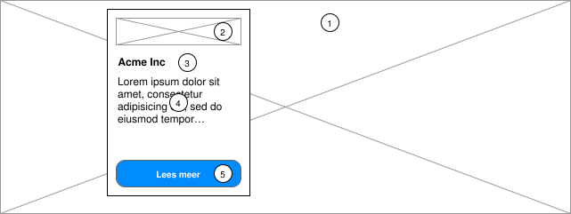
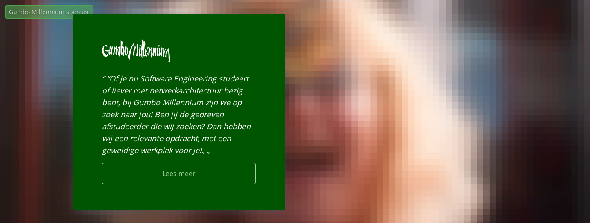
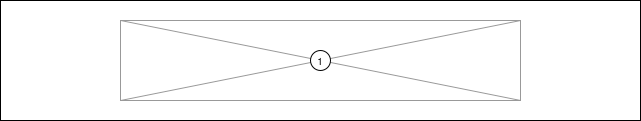
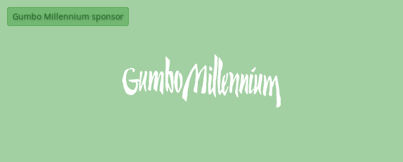
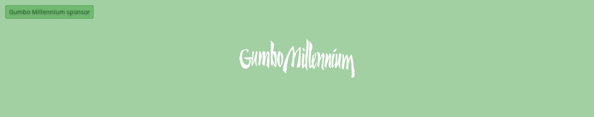

# Sponsor mogelijkheden

In de nieuwe site hebben we twee mogelijkheden voor sponsoren.

1) **Epic**: Een grote foto met een citaat en call-to-action.
2) **Banner**: Een banner

## Epic

De beste optie.

1. Achtergrondfoto, minimaal 1920 x 500
2. Logo van het bedrijf, ongeveer 200 x 60
3. Naam van het bedrijf, in format "Logo [bedrijfsnaam]"
4. Citaat of overtuiging van het bedrijf
5. "Lees meer" knop

## Weergaven

### Mobiel

### Desktop

## Banner

Een optie voor bedrijven zonder foto materiaal. Niet aanbevolen.

1. Banner van het bedrijf, minmaal 1920 x 300

## Weergaven

### Mobiel

### Desktop

