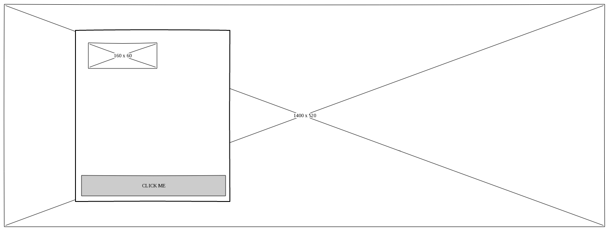
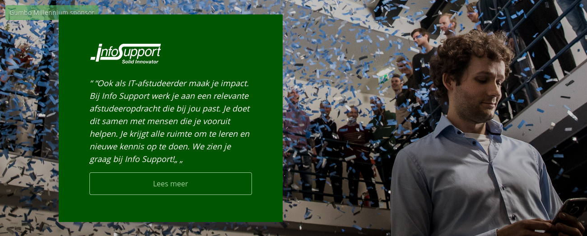

# Sponsor large

Een groot blok voor de sponsoren van Gumbo Millennium. Dient als vervanger van gifjes.

## Schermontwerp



## Implementatie



## HTML

```html
<div class="donor-large" style="background-image: url({ 1 })">
    <div class="container donor-large__container">
        <div class="donor-large__backdrop" style="background-image: url({ 1 })">
        </div>
        <div class="donor-large__info">
            
            <p class="donor-large__text">
                { 4 }
            </p>

            <a href="{ 5 }" class="donor-large__btn">
                { 6 }
            </a>
        </div>
    </div>
</div>
```

**Elementen**:

1. Achtergrondfoto, minimaal 1920 x 500
2. Logo van het bedrijf, ongeveer 200 x 60
3. Naam van het bedrijf, in format "Logo [bedrijfsnaam]"
4. Citaat of overtuiging van het bedrijf
5. Link naar sponsorsysteem met sponsor ID
6. "Lees meer" knop

**Responsive**:

Op desktop is de `donor-large__container` mbv een flexbox horizontaal uitgelijnd middels een `flex-flow: row`. De `donor-large__backdrop` wordt niet getoond en de achtergrondafbeelding van de container wordt gebruikt voor het weergeven van de afeelding.

Op mobiele apparaten (`← md`) wordt de `donor-large__backdrop` gebruikt om de afbeelding van het bedrijf boven de `donor-large__quote` te tonen. Deze is hier ongeveer 200px hoog.
De `donor-large__container` is hierbij als marginloze flexbox ingesteld, met een `flex-flow: column`.
